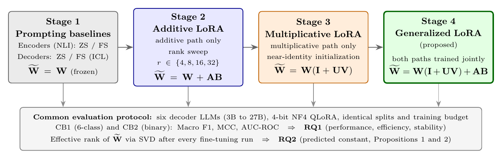

# Generalized LoRA for Cyberbullying Detection

Code and full results for the paper:

> **Generalized LoRA for Cyberbullying Detection: Combining Multiplicative and Additive Low-Rank Adaptation Across Six Decoder-Based Large Language Models**
> Aisha Saeid et al., submitted to the *International Journal of Neural Systems* (2026).



## What this research does

Existing low-rank adaptation (LoRA) methods fine-tune large language models through either an additive update (`W + AB`) or a multiplicative one (`W(I + UV)`), never both. This project introduces a **generalized formulation that trains both adapter paths jointly**:

```
W_f = W(I + UV) + AB
```

Setting `UV = 0` recovers standard LoRA and setting `AB = 0` recovers multiplicative LoRA, so the formulation strictly contains both. We evaluate it on cyberbullying detection with six decoder LLMs (3B to 27B parameters, 4-bit NF4 QLoRA) and two datasets: CB1 (6-class, tweet-level) and CB2 (binary, conversation-level).

**Headline findings:** the generalized framework achieves the best result on both datasets (Macro F1 = 0.9082 on CB1, 0.8959 on CB2, confirmed across three training seeds), reaches its best CB1 result with 3.8x fewer trainable parameters than standard LoRA (9.5M vs 35.8M), recovers a catastrophic training collapse of the purely multiplicative form (+0.1359 F1 on Mistral-7B at identical rank), and preserves the effective rank of the adapted weights exactly as the theory predicts.

## The four stages

| Stage | Formula | What it tests | Notebooks |
|-------|---------|---------------|-----------|
| **1. Baselines** | `W` (frozen) | Zero-shot and few-shot prompting, for NLI encoders (DeBERTa, RoBERTa) and all six decoders | `notebooks/stage1_baselines/` |
| **2. Additive LoRA** | `W + AB` | The standard LoRA path in isolation, rank sweep r ∈ {4, 8, 16, 32} on CB1 | `notebooks/stage2_additive_lora/` |
| **3. Multiplicative LoRA** | `W(I + UV)` | The multiplicative path in isolation, near-identity initialization | `notebooks/stage3_multiplicative_lora/` |
| **4. Generalized LoRA** | `W(I + UV) + AB` | Both paths trained jointly (proposed) | `notebooks/stage4_generalized_lora/` |

Every stage shares one evaluation protocol, so cross-stage differences isolate the adaptation formula.

### Multi-seed validation

A result that exists at only one random seed is not a result. The champion configuration (Gemma-2-9B under generalized LoRA) was therefore retrained with three training seeds (42, 123, 456) on both datasets, keeping the data split fixed so every run faces the identical test set; only weight initialization, dropout masks, and shuffling order change. All three seeds beat the best standard-LoRA and multiplicative-LoRA results on both datasets, and the CB1 mean minus two standard deviations (0.9022) stays above the standard-LoRA best (0.9010), so the improvement holds at roughly 95% confidence. Notebooks: `notebooks/multi_seed_validation/`, data: `results/multi_seed_validation.csv`.

## Models

| Model | Params | HuggingFace checkpoint |
|-------|--------|------------------------|
| Llama-3.2-3B | 3B | `meta-llama/Llama-3.2-3B-Instruct` |
| Mistral-7B | 7B | `mistralai/Mistral-7B-Instruct-v0.3` |
| Gemma-2-9B | 9B | `google/gemma-2-9b-it` |
| Qwen3-14B | 14B | `Qwen/Qwen3-14B` |
| Phi-4 | 15B | `microsoft/phi-4` |
| Gemma-3-27B | 27B | `google/gemma-3-27b-it` (CausalLM wrapper, see paper Sec. 3.2.3) |

## Reproducibility protocol

All experiments, all stages, all models:

- **Data split:** 75/25 stratified, seed 42, fixed across every run; 10% of the training pool held out for validation (effective 67.5 / 7.5 / 25). Test set touched exactly once per experiment.
- **Near-duplicate removal:** TF-IDF cosine similarity, 0.90 threshold, before splitting.
- **Quantization:** 4-bit NF4 with double quantization (QLoRA), base weights frozen.
- **Adapters:** on query, key, value, and output projections; `lora_alpha = lora_rank` (scaling 1.0); dropout 0.05.
- **Training:** one epoch, learning rate 2e-4, fixed across all models and stages. Batch sizes per model as listed in the paper (Table 2). Two exceptions carried unchanged across stages: Mistral-7B uses 100 warmup steps with cosine decay in all runs; Qwen3-14B uses the same on CB2.
- **Class weights:** applied on both datasets; essential on CB2 (imbalance 1.93:1, weights 0.3484 / 0.6516).
- **Metrics:** Macro F1 (primary), MCC (secondary), AUC-ROC on CB2. Effective rank of the adapted weights measured after every fine-tuning run via SVD (singular values above 1e-3 of the largest, averaged over adapted layers).
- **Hardware:** Google Colab, A100 40GB recommended (Gemma-3-27B requires gradient checkpointing and ~25h per CB2 run).

## Repository layout

```
notebooks/
  stage1_baselines/            encoder (NLI) and decoder prompting baselines, CB1 and CB2
  stage2_additive_lora/        W + AB
  stage3_multiplicative_lora/  W(I + UV)
  stage4_generalized_lora/     W(I + UV) + AB  (all six models on CB1, plus CB2)
  multi_seed_validation/       champion retrained at seeds 42 / 123 / 456
results/      full per-rank result grids, cross-stage tables, multi-seed and effective-rank data
figures/      the research framework diagram
```

Between models only the model name and batch size change; the training protocol is identical.

## Running the notebooks

1. Open a notebook in Google Colab (GPU runtime, A100 recommended for 9B+).
2. Add your HuggingFace token to Colab Secrets as `HF_TOKEN` (gated models: Llama, Gemma).
3. Point the data-loading cell at the datasets (below) and run top to bottom.

## Datasets

The processed datasets are in a separate repository: [aisha-phd/Cyberbullying-Detection](https://github.com/aisha-phd/Cyberbullying-Detection).

Original sources: CB1 is the fine-grained corpus of [Wang, Fu and Lu (IEEE Big Data 2020)](https://doi.org/10.1109/BigData50022.2020.9378065); CB2 builds on the conversation-level corpus of [Ejaz, Razi and Choudhury (Comput. Human Behav. 2024)](https://doi.org/10.1016/j.chb.2023.108123). Please cite the original dataset papers if you use the data.

## Related work by the authors

- Saeid, Kanojia, Neri. *Decoding Cyberbullying on Social Media: A Machine Learning Exploration.* IEEE CAI 2024. [DOI](https://doi.org/10.1109/CAI59869.2024.00084)
- Saeid, Sabu, Koushik, Neri, Kanojia. *Cyberbullying Detection via Aggression-Enhanced Prompting.* RANLP 2025. https://aclanthology.org/2025.ranlp-1.120/

## Citation

The paper is under review. Until publication, please cite:

```bibtex
@unpublished{saeid2026generalized,
  author = {Saeid, Aisha and others},
  title  = {Generalized LoRA for Cyberbullying Detection: Combining Multiplicative
            and Additive Low-Rank Adaptation Across Six Decoder-Based Large Language Models},
  note   = {Submitted to the International Journal of Neural Systems},
  year   = {2026}
}
```

## License

Code released under the [MIT License](LICENSE). Datasets keep the licenses of their original sources.
